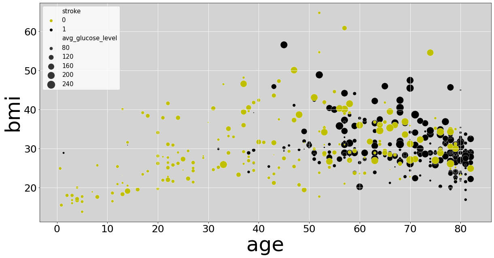
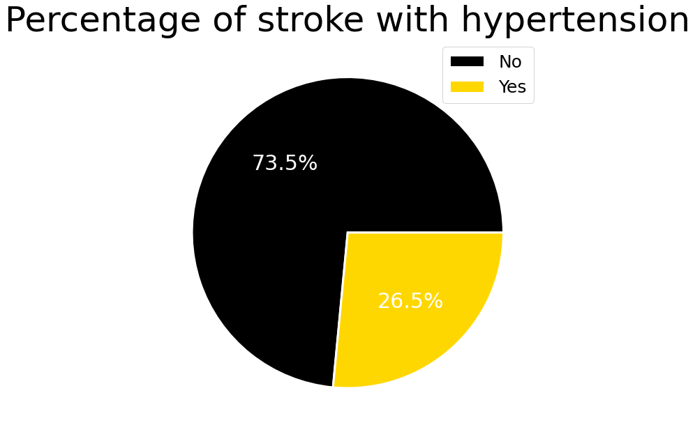
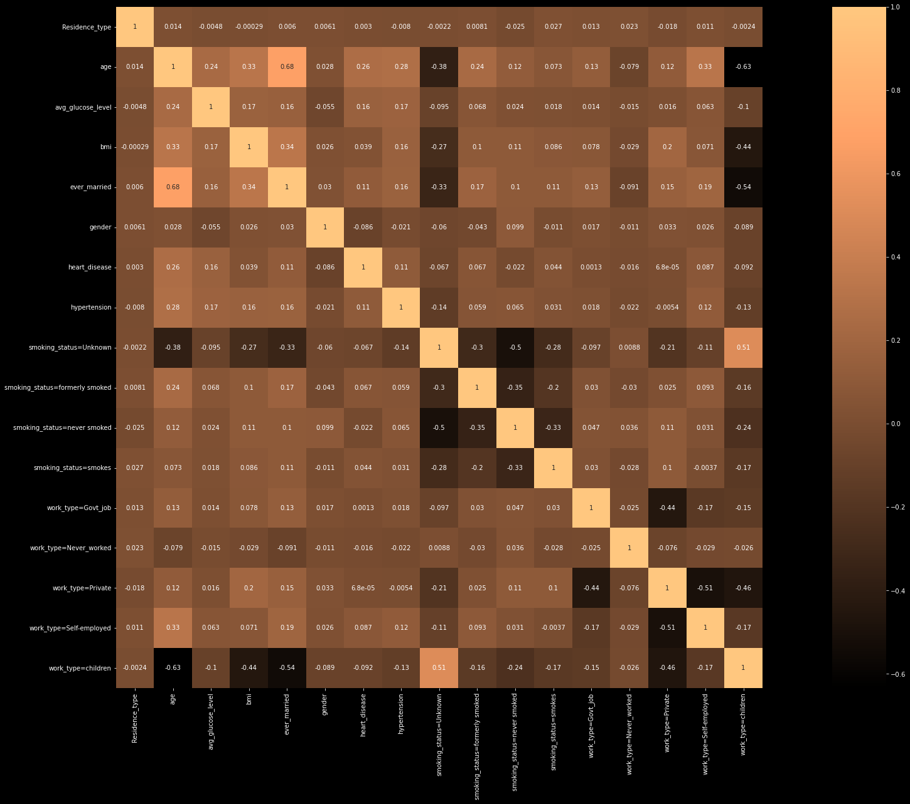

# Abstract

# Introduction

# Exploratory Data Analisys and Pre-processing

The first analisys was checking the ratio between the actual strokes and not stokes in our dataset. We realize that the data about the strokes were a few percentage of the total. Then we realized also that the choosen dataset was quite small. This two aspect were quite critical for the analisys so we decide to check if at least the data about the strokes were correct. We refers to the generical cause of strokes (inserire links) and than we compared it with our data. 

We saw that the stroke is frequent after the age of 55( 75% of strokes occur in people over the age of 65). An high body-mass index and average glucose level are also important factor. We read about Hemorrhagic stroke that accounts for approximately 3% -5% of all strokes). This rare type of stroke is normally caused by hypertension.

We saw that there was effective consistency of age, bmi, and average glucose in the stroke cases in our dataset and only 26.5% of patients who had stroke had hypertension.

 

We saw that the stroke is frequent after the age of 55( 75% of strokes occur in people over the age of 65). An high body-mass index and average glucose level are also important factor. We read about Hemorrhagic stroke that accounts for approximately 3% -5% of all strokes). This rare type of stroke is normally caused by hypertension.

We saw that there was effective consistency of age, bmi, and average glucose in the stroke cases in our dataset and only 26.5% of patients who had stroke had hypertension.

In conclusion we saw that the data were correct and we decided to continue the analisys.

For the preprocessing of the data we have implemented the following operations

1. We found some nan-values on the ‘bmi’ column of the dataset and we decided to filled them with its mean.

2. Standardized numeric values using the `sklearn.preprocessing.StandardScaler` class of sklearn

> The standard score of a sample `x` is calculated as
> 
> $z = \frac{(x - u)}{s}$
> 
> where $u$ is the mean of the training samples or zero if `with_mean=False`, and $s$ is the standard deviation of the training samples or one if `with_std=False`.

3. One-hot-encoding for the categorial features `ever_married` , `gender`, `Residence_type`.

4. For the multiple categorical features we use the class `sklearn.feature_extraction.DictVectorizer` to one-hot-encode `work_type` and `smoking_status`

After the pre-processing we end up with 17 features against the 11 starting features.

The next step was to check the correlation between the features (*figure x*) but there weren't correlation to take into account.

## Unbalanced dataset

As we sad in the precedent [nome che non ricordo] we had to managed a dataset with to few stroke cases. In order to build up a good model we had to modify our training data. We used the `imblearn.over_sampling.SMOTE` class from the imbalance learn library. 

> `SMOTE` and `ADASYN` generate new samples in by interpolation. However, the samples used to interpolate/generate new synthetic samples differ. In fact, `ADASYN` focuses on generating samples next to the original samples which are wrongly classified using a k-Nearest Neighbors classifier while the basic implementation of SMOTE will not make any distinction between easy and hard samples to be classified using the nearest neighbors rule.

# K-Neighbours

# Logistic Regression
